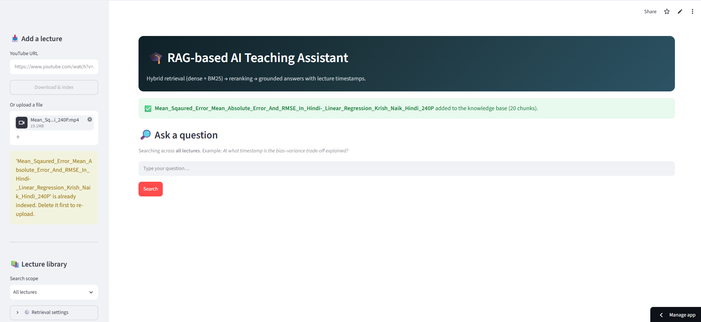
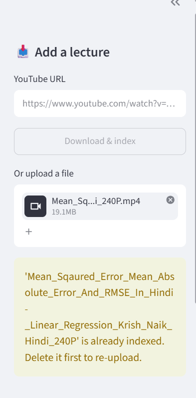
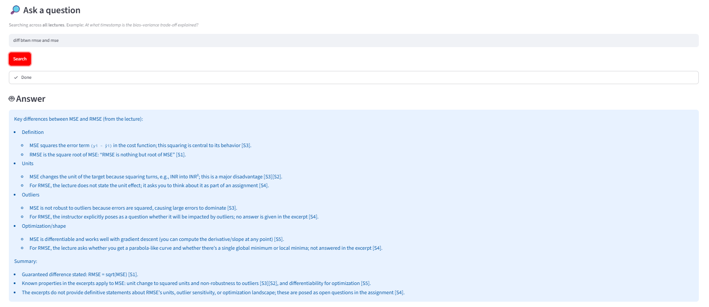
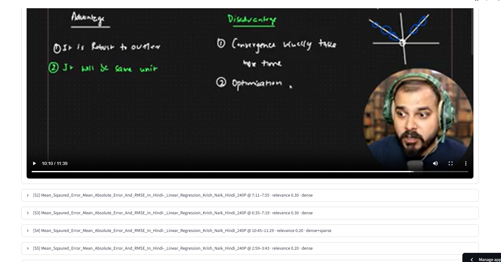
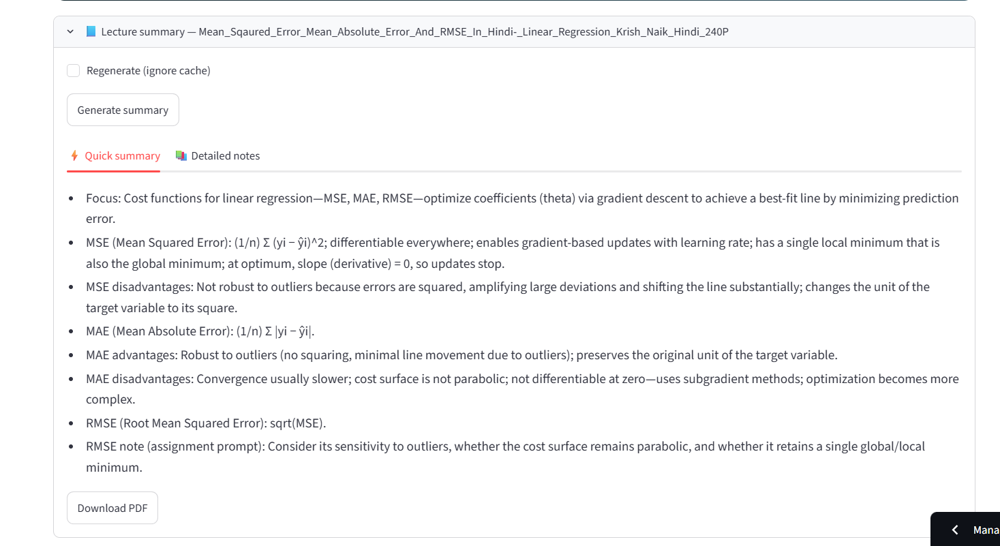
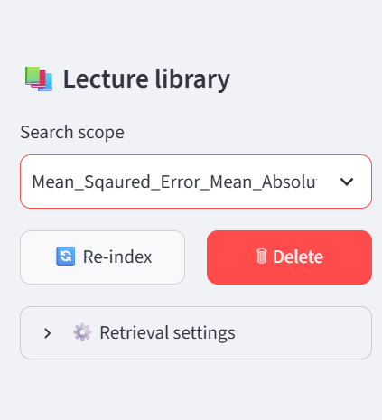
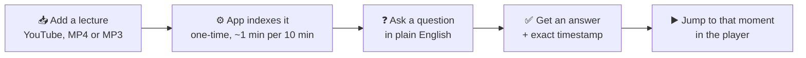
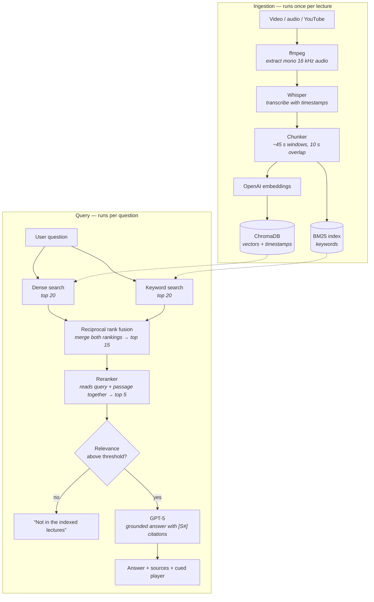

<div align="center">

# 🎓 RAG-based AI Teaching Assistant

**Ask a question about any lecture video and get an answer with the exact timestamp where it's explained.**

[](https://rag-based-ai-teaching-akash.streamlit.app/)
[](https://github.com/akashnegetive/RAG-based-AI-Teaching-Assistant/actions/workflows/ci.yml)


### 👉 **[Try the live app](https://rag-based-ai-teaching-akash.streamlit.app/)**

</div>

---

## The problem

You watched a 90-minute lecture last week. Today you need the one part where the professor explained
the bias–variance tradeoff. Scrubbing through the video to find it wastes ten minutes — and YouTube's
search only matches the title, not what was actually said.

## What this does

Upload a lecture (video, audio, or a YouTube link). The app transcribes it, indexes what was said
along with when it was said, and then answers your questions in plain language — citing the exact
minute and second, with a player that jumps straight there.

**In one sentence:** it turns lecture recordings into a searchable, question-answerable knowledge base.

| Ask this | Get this |
|---|---|
| *"At what timestamp is the bias–variance tradeoff explained?"* | An explanation plus `12:04–12:49`, with the video cued to 12:04 |
| *"What's the difference between ridge and lasso?"* | A grounded comparison, citing the two passages it came from |
| *"Summarise this lecture for tomorrow's exam"* | A quick summary and full study notes, downloadable as PDF |
| *"What is quantum chromodynamics?"* | *"I couldn't find this in the indexed lectures"* — it doesn't make things up |

---

## Screenshots

> Replace each placeholder below with your own screenshot. See [How to add screenshots](#how-to-add-screenshots).

### 1. Home — ask a question across all lectures



The main screen. Pick a scope in the sidebar (one lecture or all of them), type a question in plain
English, and hit **Search**. Query history is kept so you can re-run earlier questions with one click.

---

### 2. Ingesting a lecture



Three ways in: paste a **YouTube URL**, upload an **MP4**, or upload an **MP3/M4A/WAV**. The status
panel shows each stage as it runs — audio extraction → Whisper transcription → chunking → embedding —
so a long lecture never looks frozen. Duplicate titles are rejected before any API cost is incurred.

---

### 3. Answer with timestamp grounding



The answer cites its sources inline as `[S1]`, `[S2]`. Below it, every retrieved passage is listed with
its lecture title, timestamp range, relevance score, and which retriever found it (`dense`, `sparse`, or
both) — so you can verify the answer rather than trusting it.

---

### 4. Jump-to-timestamp playback



Expand any source and the video (or audio) player is already cued to that moment. No scrubbing.

---

### 5. Lecture summaries and study notes



Select a single lecture and generate two summaries at once: a **quick summary** (120–180 words, for the
night before an exam) and **detailed notes** (overview, key concepts, topic flow, definitions, examples,
10-line revision list). Both download as PDF. Summaries are cached, so re-opening one is instant and free.

---

### 6. Managing the library



Every indexed lecture is listed in the sidebar. **Re-index** re-chunks a lecture from its saved
transcript (useful after changing chunk settings) without paying for transcription again. **Delete**
removes its vectors and media, behind a confirmation step.

---

## How it works

### The user's journey



### Under the hood



**Why two searches instead of one?** Embeddings are good at meaning — they match *"the penalty that
zeroes out weights"* to a passage about lasso even with no shared words. But they're weak on exact
tokens: names like *Kadane*, symbols like *L2*, specific variable names. BM25 keyword search covers
exactly that gap. Reciprocal rank fusion merges the two rankings by position, so BM25 scores and cosine
distances never have to be made comparable.

**Why rerank?** A reranker reads the question and a passage *together* and judges relevance directly,
which is far more accurate than comparing two independently-computed vectors. It's too slow to run over
a whole corpus — so the cheap searches narrow things to ~15 candidates first, and the reranker picks the
best 5 from those.

**Why a threshold?** Without one, a question the lectures never cover still returns five passages and
the model dutifully writes a confident answer from them. With it, the app says it doesn't know. For a
study tool, that matters more than coverage.

---

## Tech stack

| Layer | Choice | Why |
|---|---|---|
| UI | Streamlit | Fast to build, deploys free, good enough for a single-user study tool |
| Transcription | OpenAI Whisper (`whisper-1`) | Segment-level timestamps out of the box; auto-splits files over the API's 25 MB limit |
| Embeddings | `text-embedding-3-large` | Strong retrieval quality; batched to cut request count |
| Vector store | ChromaDB | Embedded, no server to run, metadata filtering for per-lecture scoping |
| Keyword search | `rank-bm25` | Pure Python, no infrastructure, covers the exact-token gap |
| Reranking | LLM judge (default) or FlashRank | LLM needs no extra deps; FlashRank runs locally and free on CPU |
| Answers | GPT-5 | Grounded generation with inline citations |
| Quality | pytest, ruff, RAGAS, GitHub Actions, Docker | Retrieval changes are measured, not guessed at |

---

## Quick start

```bash
git clone https://github.com/akashnegetive/RAG-based-AI-Teaching-Assistant.git
cd RAG-based-AI-Teaching-Assistant

pip install -r requirements.txt     # needs ffmpeg on PATH
cp .env.example .env                # add your OPENAI_API_KEY
streamlit run app.py                # → http://localhost:8501
```

With Docker (includes ffmpeg, persists data in a volume):

```bash
cp .env.example .env
docker compose up --build           # → http://localhost:8501
```

---

## Project structure

```
rag_ta/
├── config.py            # every tunable, overridable via RAG_* env vars
├── models.py            # Segment, Chunk, RetrievedChunk
├── store.py             # Chroma persistent client
├── ingestion/
│   ├── media.py         # ffmpeg: extract audio, split long files
│   ├── transcribe.py    # Whisper with timestamp offsets across splits
│   ├── chunking.py      # timestamp-aware merge + overlap
│   └── indexer.py       # ingest / reindex / delete
├── retrieval/
│   ├── embeddings.py    # batched OpenAI embeddings
│   ├── sparse.py        # BM25 index
│   ├── fusion.py        # reciprocal rank fusion
│   ├── rerank.py        # LLM / FlashRank / none
│   └── retriever.py     # HybridRetriever orchestration
└── llm/
    ├── client.py        # OpenAI client with timeouts + retries
    ├── prompts.py       # all prompts, versioned in one place
    ├── answer.py        # grounded answer with [S#] citations
    └── summarize.py     # map-reduce summaries + disk cache
app.py                   # Streamlit UI (thin — no business logic)
tests/                   # pytest; runs without an API key
eval/run_eval.py         # RAGAS evaluation harness
```

---

## Configuration

Everything is an environment variable — see `.env.example`.

| Variable | Default | Notes |
|---|---|---|
| `OPENAI_API_KEY` | — | required |
| `RAG_CHAT_MODEL` | `gpt-5` | |
| `RAG_EMBEDDING_MODEL` | `text-embedding-3-large` | changing this requires re-indexing |
| `RAG_WHISPER_LANGUAGE` | *(auto-detect)* | pin with `hi`, `en`, … |
| `RAG_CHUNK_SECONDS` / `RAG_CHUNK_OVERLAP` | `45` / `10` | re-index after changing |
| `RAG_FINAL_TOP_K` | `5` | passages sent to the model |
| `RAG_MIN_RELEVANCE` | `0.15` | 0–1; raise it to make the app say "I don't know" more often |
| `RAG_RERANKER` | `llm` | `llm` \| `flashrank` \| `none` |

---

## Evaluation

Retrieval changes are easy to make and hard to judge by eye, so quality is measured:

```bash
pip install -r requirements-eval.txt
cp eval/dataset.example.jsonl eval/dataset.jsonl    # add your own Q/A pairs
python -m eval.run_eval --dataset eval/dataset.jsonl
```

Reports **faithfulness** (is the answer supported by the retrieved passages?), **answer relevancy**,
**context precision**, **context recall**, and average latency. Results are saved to `eval/results/`
with the exact config used, so two runs can be compared directly.

> Add your own before/after numbers here once you've run it — a table of scores is the most convincing
> thing you can put in a RAG README.

---

## Development

```bash
pip install -r requirements-dev.txt
make test     # pytest — uses fakes for OpenAI, a temp Chroma dir for the store
make lint     # ruff
```

CI runs lint and tests on Python 3.11 and 3.12 and builds the Docker image on every push and PR.

---

## What changed in v2

| Area | v1 | v2 |
|---|---|---|
| Chunking | raw Whisper segments (2–8 s) | merged ~45 s windows with 10 s overlap |
| Retrieval | dense top-5 only | dense + BM25 → RRF → reranker → top-5 |
| Unanswerable questions | always answered something | relevance threshold; says it doesn't know |
| Citations | top-1 timestamp only | every source with timestamp, score, and player |
| Transcription | `translations` (forced English), 25 MB cap | `transcriptions`, auto-splits long audio |
| Summaries | whole transcript in one prompt, regenerated each click | map-reduce for long lectures, cached |
| Code | one 1,300-line `app.py` | `rag_ta/` package, thin UI, typed models, env config |
| Quality | — | 29 unit tests, RAGAS harness, ruff, CI, Docker |

### Migrating from v1

Old `jsons/*.json` transcripts still load. Re-index them with the new chunker — no re-transcription cost:

```bash
python scripts/migrate_old_jsons.py path/to/old/jsons
```

---

## Known limitations

- **YouTube ingestion can fail** with a 403 on hosted environments — YouTube blocks datacenter IPs and
  recent `yt-dlp` needs a JavaScript runtime. Download the video and upload it instead.
- **Streamlit Cloud storage is ephemeral**: indexed lectures are lost on redeploy. Run the Docker image
  on a VM with a persistent volume if you need them to stick around.
- **Transcription quality sets the ceiling.** Heavy accents, poor audio, or dense notation (formulas read
  aloud) degrade retrieval, because the app can only find what Whisper heard correctly.

---

## How to add screenshots

1. Run the app and capture each of the six views listed above.
2. Create the folder and drop them in with these exact names:

```bash
mkdir -p docs/screenshots
# 01-home.png  02-upload.png  03-answer.png
# 04-playback.png  05-summary.png  06-library.png
```

3. Commit and push:

```bash
git add docs/screenshots README.md
git commit -m "docs: add screenshots and architecture walkthrough"
git push
```

**Tips for good screenshots:** capture the browser content area only (not the whole desktop), use a
window around 1400px wide, keep light mode for readability on GitHub, and make sure a real answer with
real timestamps is on screen — an empty state teaches the reader nothing. For screenshot 3, expand one
source card so the citation, score, and retriever tags are all visible.

---

## License

MIT
